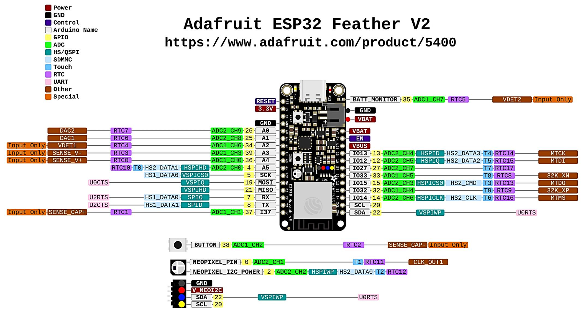
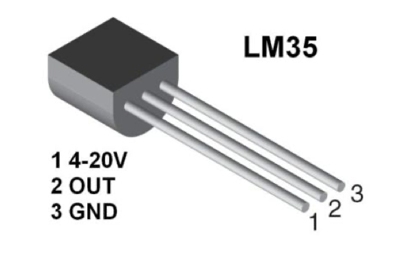

## Étapes de la mise en place

### 1. Acquisition et transmission de données

**Attention : Tous les éléments du projet doivent être connectés au même réseau wifi.**

#### A. Installation et configuration de l'IDE Arduino
Pour programmer l'ESP32, il faut ajouter le gestionnaire de cartes spécifique dans l'IDE Arduino.

1.  Ouvrir Arduino IDE.
2.  Aller dans Fichier > Préférences.
3.  Dans la case "URL de gestionnaire de cartes supplémentaires", ajouter l'URL suivante:
    ```https://raw.githubusercontent.com/espressif/arduino-esp32/gh-pages/package_esp32_index.json```
4.  Aller dans Outils > Type de carte > Gestionnaire de carte.
5.  Chercher "esp32" (par Espressif Systems) et cliquer sur Installer. <br>
Le projet nécessite des bibliothèques spécifiques dont une pour le protocole MQTT.
6.  Aller dans Croquis > Inclure une bibliothèque > Gérer les bibliothèques.
7.  Chercher et installer "Adafruit NeoPixel" (par Adafruit).
8.  Chercher et installer "Adafruit DMA neopixel library" (par Adafruit).
9.  Chercher et installer "PubSubClient" (par Nick O'Leary).
10.  Une fois installés, sélectionner la carte : Outils > Type de carte > Adafruit Feather ESP32 V2.


#### B. Câblage matériel (Capteur LM35)
Le capteur de température analogique LM35 est relié à l'ESP32.

* Pin 1 (+Vs) : Relié au 5V (USB) ou 3.3V de l'ESP32.
    * *Attention : Une alimentation en 3.3V peut fausser la mesure (minimum théorique 4V).*
* Pin 2 (Vout) : Relié à une entrée analogique, ici la borne 33.
* Pin 3 (GND) : Relié au GND de l'ESP32.




#### C. Programme principal (Acquisition & Transmission)
Le code suivant permet de se connecter au Wifi, de lire la température et de l'envoyer au Broker MQTT. Il est également disponible dans les fichiers de ce projet GitHub (`final.ino`)

> **Note :** Penser à modifier les constantes `ton_wifi`, `ton_mdp_wifi`, `mqtt_server` (IP du Raspberry), `ton_username` et `ton_password` et à changer le nom du topic L84 dans la commande "client.publish" avant de téléverser.


<details>
<summary> Cliquez ici pour voir le code Arduino </summary>

```cpp
#include <WiFi.h>
#include <PubSubClient.h>

// --- CONFIGURATION ---
const char* ssid = "ton_wifi"; //À remplacer
const char* password = "ton_mdp_wifi"; //À remplacer
const char* mqtt_server = "192.168.1.XXX"; //remplacer XXX par l'adress ip de ton Raspberry
const int mqtt_port = 1883;

// --- VARIABLES GLOBALES ---
float seuilTemperature = 0.0; // Valeur par défaut
const int sensorPin = 33;      // Pin du capteur LM35
#define VBATPIN 35             // Pin batterie 
#define RGB_BRIGHTNESS 64 

WiFiClient espClient;
PubSubClient client(espClient);
unsigned long lastMsg = 0;

void setup_wifi() {
  WiFi.begin(ssid, password);
  while (WiFi.status() != WL_CONNECTED) { delay(500); }
  rgbLedWrite(RGB_BUILTIN, 0, 0, RGB_BRIGHTNESS); // Bleu = Connecté
}

// --- RÉCEPTION DES MESSAGES ---
void callback(char* topic, byte* payload, unsigned int length) {
  String message = "";
  for (int i = 0; i < length; i++) { message += (char)payload[i]; }

  // Cas 1 : Réception du nouveau seuil
  if (String(topic) == "station/seuil") {
    seuilTemperature = message.toFloat();
    Serial.print("Nouveau seuil reçu : ");
    Serial.println(seuilTemperature);
    
    // Petit flash blanc pour confirmer la réception
    rgbLedWrite(RGB_BUILTIN, 255, 255, 255);
    delay(100);
    rgbLedWrite(RGB_BUILTIN, 0, 0, 0);
  }
}

void reconnect() {
  while (!client.connected()) {
    if (client.connect("ESP32_Ronan", "ton_username", "ton_password")) { //À remplacer
      // S'abonner aux ordres de Node-RED
      client.subscribe("station/led");
      client.subscribe("station/seuil"); 
    } else {
      delay(5000);
    }
  }
}

void setup() {
  Serial.begin(115200);
  setup_wifi();
  client.setServer(mqtt_server, mqtt_port);
  client.setCallback(callback);
}

void loop() {
  if (!client.connected()) { reconnect(); }
  client.loop();

  unsigned long now = millis();
  if (now - lastMsg > 20000) { //Périodicité de la mesure en millisecondes
    lastMsg = now;

    // 1. Lectures LM35 et Batterie 
    float temp = ((analogRead(sensorPin) / 4095.0) * 3300.0) / 4.7; // le 4,7 correspond à un coefficient qui permet d'avoir la bonne température
    float vbat = (analogReadMilliVolts(VBATPIN) * 2.0) / 1000.0;

    // 2. Alerte locale avec la LED RGB
    if (temp > seuilTemperature) {
      rgbLedWrite(RGB_BUILTIN, RGB_BRIGHTNESS, 0, 0); // ROUGE si dépassement
    } else {
      rgbLedWrite(RGB_BUILTIN, 0, RGB_BRIGHTNESS, 0); // VERT si OK
    }

    // 3. Envoi des données vers Node-RED
    String payload = String(temp) + "," + String(vbat);
    client.publish("ton_topic", payload.c_str()); //À remplacer
  }
}
```

</details>

---

## Configuration du Broker MQTT (Raspberry Pi)

Le Raspberry Pi héberge le Broker Mosquitto. C'est le serveur central qui va recevoir les mesures de l'ESP32 et les redistribuer à l'interface graphique.

*Pré-requis : Mosquitto est supposé déjà installé sur le Raspberry Pi.*

#### D. Édition du fichier de configuration
Par défaut, Mosquitto est sécurisé et bloque les connexions externes. Nous devons le configurer pour accepter les messages venant de l'ESP32 via le WiFi.

Ouvrez le fichier de configuration principal :
    ```bash
    sudo nano /etc/mosquitto/mosquitto.conf
    ```

Supprimez le contenu existant et remplacez-le par la configuration suivante :

    ```conf
    # --- CONFIGURATION IOT ---
    pid_file /var/run/mosquitto.pid
    
    # 1. Persistance : Garde les messages en mémoire si le Pi redémarre
    persistence true
    persistence_location /var/lib/mosquitto/
    
    # 2. Logs : Utile pour voir les erreurs de connexion
    log_dest file /var/log/mosquitto/mosquitto.log
    
    # 3. Réseau : Écoute sur le port standard 1883 pour toutes les adresses IP (0.0.0.0)
    # C'est indispensable pour que l'ESP32 puisse se connecter.
    listener 1883 0.0.0.0
    
    # 4. Sécurité : Autorise les connexions avec mot de passe 
    allow_anonymous false 
    password_file etc/mosquitto/pwfile
    ```

Sauvegardez le fichier (`CTRL+O`, `Entrée`) et quittez (`CTRL+X`).

#### E. Redémarrage du service
Pour que la nouvelle configuration soit prise en compte, redémarrez Mosquitto :
```bash
sudo systemctl restart mosquitto
```

#### F. Créer un topic et commandes de test
* Il faut maintenant créer un nom d'utilisateur et un mot de passe. Il faut que ces informations soient les mêmes que celles renseignées dans le script Arduino.
```bash
sudo mosquitto_passwd -c /etc/mosquitto/pwfile ton_username
``` 
Il faut écrire un mot de passe et le valider. 

* Ensuite, cette commande permet de s'abonner à un topic :
```bash
sudo mosquitto_sub -h localhost -t ton_topic -u ton_username -P ton_password
```
* Publier un message sur un topic : *_Note : Ouvrir un second terminal_
```bash
sudo mosquitto_pub -h localhost -t ton_topic -m "Message" -u ton_username -P ton_password
```
Si tout fonctionne le message "Message" doit s'afficher dans le terminal avec le mosquitto_sub

### 2. Stockage et exploitation des données

La deuxième étape consiste à stocker les données de températures et de tension d'alimentation de la batterie dans une base de données SQLite sur le Raspberry Pi. 
La base de données doit être optimisée de manière à faciliter la récupération et l'exploitation des données.
Pour ce faire, il faut créer une base de données SQLite et une fonction python permettant de récupérer les données et de les implanter directement dans la base de données.

**Commandes effectuées dans le terminal de commande du Raspberry** <br>
Installer SQLite :
```bash
sudo apt update
sudo apt install sqlite3
sudo apt install python3-paho-mqtt
```

Pour rentrer dans la console SQLite :
```bash
sqlite3 temperature.db
```

Créer la base de données : 
```sql
CREATE TABLE mesures (
    id INTEGER PRIMARY KEY AUTOINCREMENT,
    temperature REAL
    tension REAL,
    date DATETIME DEFAULT CURRENT_TIMESTAMP
);
```

Il faut ensuite sortir de la console sqlite (.quit) et créer le script Python permettant d'enregistrer directement les valeurs de température :
```bash
nano mqtt_to_sqlite.py
```

```python
import sqlite3
import paho.mqtt.client as mqtt

# Configuration
BROKER = "localhost"
PORT = 1883
TOPIC = "test_topic"
USERNAME = "warren2"
PASSWORD = "warren"
DB_FILE = "temperature.db"

def on_connect(client, userdata, flags, rc):
    print("Connecté au broker MQTT")
    client.subscribe(TOPIC)

def on_message(client, userdata, msg):
    try:
        temperature, tension = map(float, msg.payload.decode().split(','))
        print(f"Température reçue : {temperature} °C, Tension de la batterie : {tension} V")

        conn = sqlite3.connect(DB_FILE)
        cursor = conn.cursor()

        cursor.execute(
            "INSERT INTO mesures (temperature, tension) VALUES (?, ?)",
            (temperature, tension)
        )

        conn.commit()
        conn.close()

        print("Données enregistrées dans SQLite")

    except Exception as e:
        print("Erreur : {e}")

client = mqtt.Client()
client.username_pw_set(USERNAME, PASSWORD)
client.on_connect = on_connect
client.on_message = on_message

client.connect(BROKER, PORT, 60)
client.loop_forever()
```

On active ensuite la fonction pour récupérer les données et les enregistrer dans la base de données (il faut laisser la fonction tourner pour continuer à enregistrer les valeurs) :
```bash
python3 mqtt_to_sqlite.py
```
Pour afficher la base de données, il faut ouvrir un nouveau terminal et rentrer dans la console SQLite et utiliser la fonction suivante :
```sql
SELECT * FROM mesures;
```

Pour récupérer les données et faciliter leur exploitation, on convertit la base de données en un fichier CSV : 
```bash
sqlite3 -header -csv temperature.db "SELECT * FROM mesures;" > mesures_export.csv
```

### 3. Affichage et interface utilisateur

Node-RED est utilisé pour l'interface graphique (Dashboard) et la logique d'alerte. Il s'exécute sur le Raspberry Pi et communique avec l'ESP32 via le protocole MQTT.

#### A. Installation 
Si ce n'est pas déjà fait sur le Raspberry Pi :
1.  **Installer Node-RED :**
    `bash <(curl -sL https://raw.githubusercontent.com/node-red/linux-installers/master/deb/update-nodejs-and-nodered)`
2.  **Lancer le service :**
    `sudo systemctl start nodered`
3.  Cliquer sur le lien pour accéder à une page web avec node-red

Si vous souhaitez utiliser Node-RED sur votre pc : 
1. **Site web :**
   `https://nodejs.org/en/download`
2. **Installer Node-RED :**
   Cliquer sur `Windows installer (.msi)` ou `macOS installer (.pkg)`
3. **Lancer Node-RED :**
   Ouvrir un terminale de commande et copier la commande suivante : (Pour les macs)
   
<details>
<summary> Cliquez ici pour voir la commande d'installation </summary>  
    
* Download and install nvm:
`curl -o- https://raw.githubusercontent.com/nvm-sh/nvm/v0.40.3/install.sh | bash`
* in lieu of restarting the shell :
`\. "$HOME/.nvm/nvm.sh"`
* Download and install Node.js :
`nvm install 24`
* Verify the Node.js version :
`node -v # Should print "v24.13.0".`
* Verify npm version :
`npm -v # Should print "11.6.2".`

</details>

Pour les windows, il suffit d'écrire `node-red` dans le terminal puis de cliquer sur le lien et une page web avec Node-RED s'ouvre.
   
Le flux nécessite le module de tableau de bord. Dans Node-RED, allez dans Menu (3 barres) > Manage Palette > Install et installez :
* `node-red-dashboard`

#### B. Importation du Flux
Pour reproduire l'interface complète, copiez le code JSON ci-dessous et importez-le dans Node-RED (Menu > Import).

<details>
<summary> Cliquez ici pour voir le Code JSON du Flux Node-RED</summary>

```json
[
    {
        "id": "9430e1768d7b09cf",
        "type": "tab",
        "label": "Projet IOT Température",
        "disabled": false,
        "info": "Interface de surveillance pour le projet ESP32/Raspberry Pi"
    },
    {
        "id": "fb644d4f3cc18d14",
        "type": "mqtt in",
        "z": "9430e1768d7b09cf",
        "name": "Réception ESP32",
        "topic": "test_topic",
        "qos": "0",
        "datatype": "auto-detect",
        "broker": "d927f185b91f4d9a",
        "nl": false,
        "rap": true,
        "rh": 0,
        "inputs": 0,
        "x": 180,
        "y": 120,
        "wires": [
            [
                "d06d500d418ab21e",
                "6f7b3e78c808e7df",
                "9ec22d47886431c1"
            ]
        ]
    },
    {
        "id": "d06d500d418ab21e",
        "type": "ui_gauge",
        "z": "9430e1768d7b09cf",
        "name": "Jauge Temps Réel",
        "group": "17be8fcecf3a4397",
        "order": 1,
        "width": 0,
        "height": 0,
        "gtype": "gage",
        "title": "Température Actuelle",
        "label": "°C",
        "format": "{{value}}",
        "min": "0",
        "max": "35",
        "colors": [
            "#00b500",
            "#e6e600",
            "#ca3838"
        ],
        "seg1": "",
        "seg2": "",
        "diff": false,
        "className": "",
        "x": 530,
        "y": 60,
        "wires": []
    },
    {
        "id": "6f7b3e78c808e7df",
        "type": "ui_chart",
        "z": "9430e1768d7b09cf",
        "name": "Graphique Historique",
        "group": "17be8fcecf3a4397",
        "order": 2,
        "width": 0,
        "height": 0,
        "label": "Évolution de la Température",
        "chartType": "line",
        "legend": "false",
        "xformat": "HH:mm:ss",
        "interpolate": "linear",
        "nodata": "",
        "dot": false,
        "ymin": "10",
        "ymax": "30",
        "removeOlder": "10",
        "removeOlderPoints": "",
        "removeOlderUnit": "60",
        "cutout": 0,
        "useOneColor": false,
        "useUTC": false,
        "colors": [
            "#1f77b4",
            "#aec7e8",
            "#ff7f0e",
            "#2ca02c",
            "#98df8a",
            "#d62728",
            "#ff9896",
            "#9467bd",
            "#c5b0d5"
        ],
        "outputs": 1,
        "useDifferentColor": false,
        "className": "",
        "x": 540,
        "y": 180,
        "wires": [
            []
        ]
    },
    {
        "id": "9ec22d47886431c1",
        "type": "debug",
        "z": "9430e1768d7b09cf",
        "name": "Vérif Debug",
        "active": true,
        "tosidebar": true,
        "console": false,
        "tostatus": false,
        "complete": "payload",
        "targetType": "msg",
        "statusVal": "",
        "statusType": "auto",
        "x": 510,
        "y": 260,
        "wires": []
    },
    {
        "id": "e986644029828d37",
        "type": "mqtt in",
        "z": "9430e1768d7b09cf",
        "name": "Réception Température",
        "topic": "test_topic",
        "qos": "0",
        "datatype": "auto",
        "broker": "d927f185b91f4d9a",
        "nl": false,
        "rap": false,
        "inputs": 0,
        "x": 160,
        "y": 320,
        "wires": [
            [
                "cef562c2b5e36407"
            ]
        ]
    },
    {
        "id": "cef562c2b5e36407",
        "type": "function",
        "z": "9430e1768d7b09cf",
        "name": "Comparaison & Alerte",
        "func": "// 1. Découpage du message combiné de l'ESP32 (\"temp,vbat\")\nvar values = msg.payload.split(',');\nvar temp = parseFloat(values[0]); // La température est la première valeur\n\n// 2. Récupération du seuil mémorisé (30 par défaut si le curseur n'a pas bougé)\nvar seuil = flow.get('seuil_critique') || 10;\n\n// 3. Logique d'alerte\nif (temp > seuil) {\n    msg.payload = {\n        \"content\": \"\\n\" +\n                   \"Le capteur détecte une surchauffe !\\n\" +\n                   \"**Température :** \" + temp + \"°C\\n\" +\n                   \"**Seuil défini :** \" + seuil + \"°C\"\n    };\n    msg.headers = { \"content-type\": \"application/json\" };\n    return msg;\n}\n\n// Si la température est inférieure au seuil, on ne fait rien\nreturn null;",
        "outputs": 1,
        "timeout": "",
        "noerr": 0,
        "initialize": "",
        "finalize": "",
        "libs": [],
        "x": 440,
        "y": 320,
        "wires": [
            [
                "56310bfdf75e173c"
            ]
        ]
    },
    {
        "id": "56310bfdf75e173c",
        "type": "http request",
        "z": "9430e1768d7b09cf",
        "name": "Envoi Discord",
        "method": "POST",
        "ret": "txt",
        "paytoqs": "ignore",
        "url": "https://discord.com/api/webhooks/1463816345618616465/5yeoTBd7lCXpfBpflFKkEiOnApVNg7CqFjQSfJexRT98lIg6BO6UFmLYccVb0EwQFjs7",
        "tls": "90ec97b54df48d65",
        "persist": false,
        "proxy": "",
        "insecureHTTPParser": false,
        "authType": "",
        "senderr": false,
        "headers": [],
        "x": 700,
        "y": 320,
        "wires": [
            []
        ]
    },
    {
        "id": "34ccb5569db935f5",
        "type": "ui_slider",
        "z": "9430e1768d7b09cf",
        "name": "Curseur Seuil",
        "label": "Seuil {{value}} °C",
        "tooltip": "",
        "group": "17be8fcecf3a4397",
        "order": 2,
        "width": 0,
        "height": 0,
        "passthru": true,
        "outs": "all",
        "topic": "topic",
        "topicType": "msg",
        "min": "0",
        "max": "30",
        "step": 1,
        "className": "",
        "x": 140,
        "y": 400,
        "wires": [
            [
                "17f3cbfa04924cb9",
                "972fdf71517f7e43"
            ]
        ]
    },
    {
        "id": "2098fde4455d444e",
        "type": "mqtt out",
        "z": "9430e1768d7b09cf",
        "name": "",
        "topic": "station/seuil",
        "qos": "",
        "retain": "",
        "respTopic": "",
        "contentType": "",
        "userProps": "",
        "correl": "",
        "expiry": "",
        "broker": "d927f185b91f4d9a",
        "x": 570,
        "y": 400,
        "wires": []
    },
    {
        "id": "17f3cbfa04924cb9",
        "type": "function",
        "z": "9430e1768d7b09cf",
        "name": "stockage seuil",
        "func": "flow.set('seuil_critique', parseFloat(msg.payload));\nreturn msg;",
        "outputs": 1,
        "timeout": 0,
        "noerr": 0,
        "initialize": "",
        "finalize": "",
        "libs": [],
        "x": 360,
        "y": 400,
        "wires": [
            [
                "2098fde4455d444e"
            ]
        ]
    },
    {
        "id": "972fdf71517f7e43",
        "type": "debug",
        "z": "9430e1768d7b09cf",
        "name": "debug 1",
        "active": true,
        "tosidebar": true,
        "console": false,
        "tostatus": false,
        "complete": "false",
        "statusVal": "",
        "statusType": "auto",
        "x": 440,
        "y": 500,
        "wires": []
    },
    {
        "id": "d927f185b91f4d9a",
        "type": "mqtt-broker",
        "name": "Mosquitto Raspberry",
        "broker": "192.168.1.125",
        "port": "1883",
        "tls": "90ec97b54df48d65",
        "clientid": "",
        "autoConnect": true,
        "usetls": false,
        "protocolVersion": "4",
        "keepalive": "60",
        "cleansession": true,
        "autoUnsubscribe": true,
        "birthTopic": "",
        "birthQos": "0",
        "birthPayload": "",
        "birthMsg": {},
        "closeTopic": "",
        "closeQos": "0",
        "closePayload": "",
        "closeMsg": {},
        "willTopic": "",
        "willQos": "0",
        "willPayload": "",
        "willMsg": {},
        "userProps": "",
        "sessionExpiry": ""
    },
    {
        "id": "17be8fcecf3a4397",
        "type": "ui_group",
        "name": "Mesures Capteur",
        "tab": "157792dfbfde3145",
        "order": 1,
        "disp": true,
        "width": "6",
        "collapse": false,
        "className": ""
    },
    {
        "id": "90ec97b54df48d65",
        "type": "tls-config",
        "name": "SSL-Raspberry",
        "cert": "",
        "key": "",
        "ca": "",
        "certname": "",
        "keyname": "",
        "caname": "certificat.txt",
        "servername": "",
        "verifyservercert": false,
        "alpnprotocol": ""
    },
    {
        "id": "157792dfbfde3145",
        "type": "ui_tab",
        "name": "Surveillance Température",
        "icon": "dashboard",
        "disabled": false,
        "hidden": false
    },
    {
        "id": "376ea541b3a37177",
        "type": "global-config",
        "env": [],
        "modules": {
            "node-red-dashboard": "3.6.6"
        }
    }
]
```

</details>

Il est possible de modifier les températures min et max affichée sur le graphique ainsi que sur la jauge en double cliquant sur le nœud.
Pour ouvrir le dashboard il suffit d'ouvrir une nouvelle page dans son navigateur : `http:<ADRESSE_IP_DU_RASPBERRY>:1880/ui`

### 4. Alertes et automatisation

Ce projet utilise le système de Webhooks de Discord. C'est une méthode simple qui permet au Raspberry Pi d'envoyer des messages dans un salon de discussion sans avoir besoin de créer un "Bot" complexe.

#### A. Création du Webhook (Sur Discord)

1.  **Choisir le salon :**
    * Allez sur votre serveur Discord.
    * Repérez le salon textuel où vous voulez recevoir les alertes (exemple : `#général` ou créez un salon `#alertes-iot`).
    * Cliquez sur la roue dentée (Modifier le salon) à côté du nom du salon.

2.  **Accéder aux Intégrations :**
    * Dans le menu de gauche, cliquez sur Intégrations.
    * Cliquez sur le bouton Webhooks.

3.  **Générer l'URL :**
    * Cliquez sur Nouveau Webhook.
    * Donnez-lui un nom (ex: *Capteur IUT*).
    * *(Optionnel)* Changez son avatar.
    * **IMPORTANT :** Cliquez sur le bouton Copier l'URL du Webhook.
    * *Gardez cette URL secrète, elle ressemble à : `https://discord.com/api/webhooks/12345.../AbCdEf...`*
    * Cliquez sur Enregistrer.

#### B. Connexion avec Node-RED

Maintenant que vous avez votre "adresse de livraison" (l'URL), il faut la donner à Node-RED.

1.  Ouvrez l'interface de Node-RED (`http://<IP_RASPBERRY>:1880`).
2.  Localisez le nœud de type `http request` nommé "Envoi Discord".
3.  Double-cliquez dessus pour l'ouvrir.
4.  Dans le champ URL, effacez le contenu existant.
5.  Collez l'URL du Webhook que vous avez copiée à l'étape 1.
6.  Vérifiez que la Method est bien réglée sur `POST`.
7.  Cliquez sur Done.
8.  N'oubliez pas de cliquer sur le bouton rouge Deploy en haut à droite pour valider les changements.

#### C. Tester l'alerte

Pour vérifier que tout fonctionne :

1.  Ouvrez votre Dashboard (`http://<IP_RASPBERRY>:1880/ui`).
2.  Repérez la température actuelle affichée par la jauge.
3.  Descendez le Curseur Seuil en dessous de cette valeur (ex: réglez-le à 15°C).
4.  Attendez la prochaine remontée de données de l'ESP32 (environ 20 secondes).
5.  **Résultat :**
    * La LED de l'ESP32 doit passer au Rouge.
    * Vous devez recevoir instantanément une notification sur Discord avec le message d'alerte.
