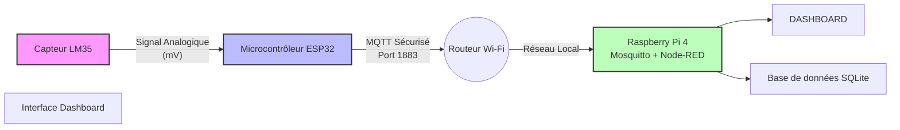

# Station Météo IoT Sécurisée   (LM35 + ESP32 + Raspberry Pi)

L'objectif de se projet  est de mettre en place une station de surveillance de température connectée, robuste et sécurisée. L'objectif est de récupérer les données d'un capteurs de température, de les transmettre de manière chiffrée (TLS/SSL) à un serveur central, de les visualiser en temps réel et également de les stocker dans une base de données.  

L'objectif premier est d'acheminer les mesures de températures jusqu'à la carte Raspberry Pi. Pour ce faire, la température est lu avec le LM35 sur l'ESP32. 
L’utilisation de la carte ESP32 en amont du Raspberry Pi s'explique par la capacité de l'ESP32 à interagir avec des capteurs analogiques, contrairement à le Raspberry Pi. L'ESP32 permet également de convertir un signal analogique en un signal numérique pour transmettre l'information à le Raspberry Pi. 
Pour finir, l'ESP32 offre une consommation énergétique très faible grâce à ses modes de veille, ce qui le rend adapté aux mesures périodiques. 

## Architecture du projet

Le système repose sur une architecture MQTT distribuée :
1.  **Capteur :** capteur LM35 + microcontrôleur ESP32 (Lecture analogique).
2.  **Transport :** MQTT via TLS/SSL (Port 8883) + Wi-Fi.
3.  **Broker :** Mosquitto tournant sur la Raspberry Pi 4.
4.  **Visualisation :** Node-RED (Dashboard).
5.  **Stockage :** base de données SQLite 

## Matériel utilisé

* **Capteur :** LM35 (Capteur de température).
* **Microcontrôleur :** ESP32.
* **Serveur :** Raspberry Pi 4 (OS : Raspberry Pi OS).
* **Réseau :** Wi-Fi Local (LAN).

## Enregistrement des données

Nous avons utilisé SQLite pour enregistrer les mesures de température dans un base de données. 
Pour faciliter le traitement et l'analyse de ces données, nous les avons converties en fichier csv, disponible dans les fichiers de ce projet GitHub (Base_de_données.csv).

## Une vidéo récapitulative du fonctionnement du projet est disponible dans les fichiers du GitHub.
